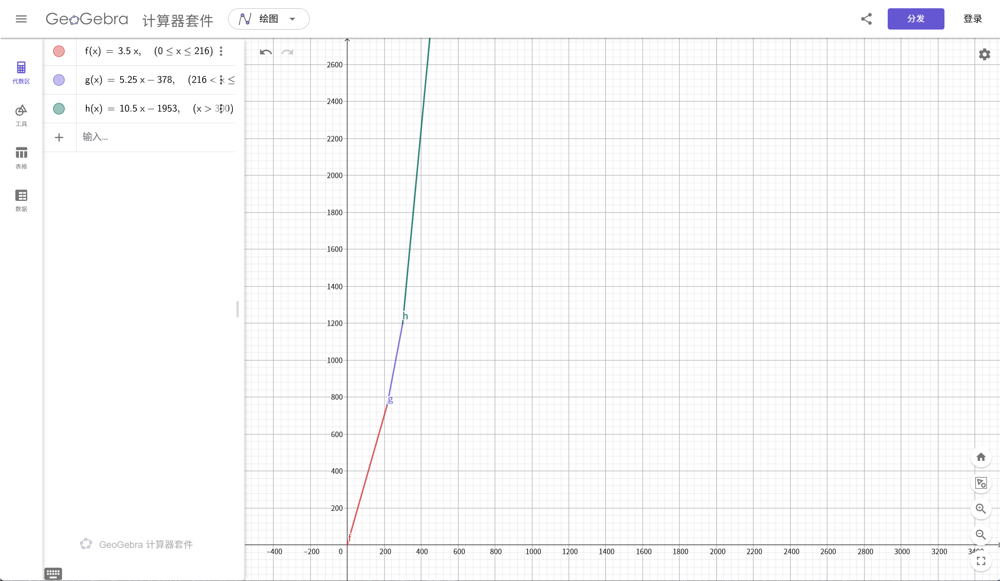

## 摘要

在城市普遍实行阶梯水价的当今社会，用水越多，单价越贵。
如何在保证生活质量的前提下将用水成本降低是所有家庭都面临的重要问题。
本文使用一些简单的数学方法，通过构建模型、分析方案等研究方法，同时采用信息技术等手段，分析了一些节水思路和方案，尝试提出一些可行性建议。

<!-- more -->

## 现状诊断与费用复盘

经过对政策的调研，我们有这样一个关于“阶梯水价”的收费表：

**表 1：“阶梯水价”收费表**

|   阶梯   | 年用水量区间 / $m^3$ | 综合单价 / 元 |
| -------- | -------------------- | ------------- |
| 第一阶梯 |   $0 \le x \le 216$  |      3.50     |
| 第二阶梯 |   $216 < x \le 300$  |      5.25     |
| 第三阶梯 |       $x > 300$      |     10.50     |

<small>*注：对于家庭人口超过 4 人的用户，每增加 1 人，各阶梯水量基数增加 $30 m^3$/年。*</small>

根据表，我们可以得到水费 $c$ 关于用水量 $v$ 的函数关系：

$$
c(v)=
\begin{cases}

  3.5v, & \quad v\in[0,216] \\

  5.25v - 378, & \quad v\in(216,300] \\

  10.5v - 1953, & \quad v\in(300,+\infty) \\

\end{cases}
$$

使用 GeoGebra 可以直观地查看 $c(v)$ 的图像：

<small>*注：这里对不同阶梯采用不同的颜色。*</small>

根据对李明一家三口的调研，以下是李明一家的年用水数据。

可以看出，在夏季，尤其是 7、8 月，用水一度达到了 $30m^3$ 以上。

**表 2：李明一家三口年用水详情**

| 月份 | 用水量 / $m^3$ |             主要异常原因记录            |
| ---- | -------------- | --------------------------------------- |
|   1  |      18.5      |              冬季，用水正常             |
|   2  |      16.2      |     春节期间部分时间回老家，用水减少    |
|   3  |      19.8      |                 恢复正常                |
|   4  |      21.5      |          春季换季，洗衣频率增加         |
|   5  |      24.0      |          天气转热，淋浴时间变长         |
|   6  |      28.5      |     梅雨季节衣物难干，洗衣机使用频繁    |
|   7  |      32.0      | 暑假开始，李明在家时间长，日均淋浴 2 次 |
|   8  |      34.5      |  高温酷暑，每日冲洗地面降温，用水量激增 |
|   9  |      26.0      |      开学后用水回落，但仍高于上半年     |
|  10  |      22.5      |              秋季，用水平稳             |
|  11  |      20.0      |              冬季，用水减少             |
|  12  |      19.5      |              年终，用水正常             |

我们将其年总用水量 $283.0m^3$ 代入函数 $c(v)$ 中可得 $c(283) = 1107.75$，即李明一家三口一年总水费为 1107.75 元。

在这里，我们引入年亏损额这一概念。

年亏损额 $l$ 代表年用水量 $v$ 以“阶梯水价”计价方式计算出来的水费与以第一阶梯水单价计价方式计算出来的水费的差值，
即：$$l = c(v) - 3.5v$$

因此，李明一家的年亏损额

$$
\begin{align}
  l &= c(283) - 3.5 \times 283 \nonumber \\
    &= 1107.75 - 990.5 \nonumber \\
    &= 117.25 \nonumber
\end{align}
$$

## 节水方案模拟与对比

由表 1 不难看出，第二阶梯与第三阶梯间单价存在巨大的差距，第三阶梯水单价是第二阶梯水单价的 2 倍。
因此，节水以使年用水量尽量不触及第三阶梯势在必行！

根据市场调研，得到以下三种节水方案及其成本。我们将依次对其进行探讨分析。

**表 3：节水方案**

| 方案 |   项目名称   |                 具体措施                 | 预估成本 / 元 |            预计节水效果           |        后续成本       |
| ---- | ------------ | ---------------------------------------- | ------------- | --------------------------------- | --------------------- |
|   A  |  淋浴头升级  |       更换为增压节水花洒（带开关）       |      120      | 每次淋浴节水 $30\%$（约 15 L/次） |      仅 3 年寿命      |
|   B  |  洗衣机置换  | 购买一级能效滚筒洗衣机，替换旧波轮洗衣机 |      2200     | 每次洗衣节水 $40\%$（约 60 L/次） | 仅 8 年寿命；电费略增 |
|   C  | 行为习惯干预 | 安装计时器，刷牙关水，缩短淋浴至 10 分钟 |       20      |   预计全家月总用水量减少 $15\%$   |   易反弹，需长期坚持  |

### 估算用水占比

当然，在正式开始之前，我们需要对李明一家各方面用水的占比做一个估计。

我们在这里确定用水分为 3 方面：淋浴、洗衣和其他。

根据相关参考数据，我们在这里分别给出三条公式去计算各方面分别的用水量：

$$
v_{Bath} = 12Dt
$$

$$
v_{Wash} = 0.15T
$$

$$
v_{Other} = v - v_{Bath} - v_{Wash}
$$

其中，$D$ 为淋浴天数，$t$ 为淋浴时间，$T$ 为洗衣次数。

根据李明一家 2025 年的年用水量，结合参考数据，我们有以下推导：

父亲每天淋浴 1 次，每次 15 分钟，则其淋浴用水量为 $12 \times 365 \times 15 = 65700L = 65.7m^3$；

我们大致估计母亲每次淋浴 10 分钟，则其淋浴用水量为 $12 \times 365 \times 10 = 43800L = 43.8m^3$。

对李明的淋浴部分进行分组，分为非暑期和暑期两部分。

则非暑期部分为 $12 \times 303 \times 20 = 72720L = 72.72m^3$；
暑期部分为 $12 \times 62 \times 20 \times 2 = 29760L = 29.76m^3$。
所以李明总用水量为 $72.72 + 29.76 = 102.48m^3$

所以李明一家全年淋浴用水为 $65.7 + 43.8 + 102.48 = 211.98m^3$，
可得占比 $(211.98 \div 283) \times 100\% \approx 75\%$

然后是洗衣用水。

我们依旧将其分为暑期和非暑期。

暑期共 8 周，每周 5 次，则暑期洗衣次数为 $8 \times 5 = 40$；
同理可得，非暑期洗衣次数为 $44 \times 3 = 132$。

所以总洗衣次数为 $132 + 40 = 172$。

所以洗衣用水量为 $0.15 \times 172 = 25.8m^3$，
可得占比 $(25.8 \div 283) \times 100\% \approx 9\%$

那么我们可以得到其他用水占比为 $100\% - 75\% - 9\% = 16\%$

总结为下表：

**表 4：李明一家用水占比详情**

|   分类   | 占比 / $\%$ |
| -------- | ----------- |
| 淋浴用水 |      75     |
| 洗衣用水 |      9      |
| 其他用水 |      16     |

我们定义：

1. $p$ 为年节水比例；

2. $v_s$ 为年节省水量；

3. $c_s$ 为年节省水费。

### 方案 A

根据相关数据，我们可以计算出方案 A 的年节水比例

$$
\begin{align}
  p &= 75\% \times 30\% \nonumber \\
    &= 22.5\% \nonumber
\end{align}
$$

然后，我们可以据此计算出年节省水量

$$
\begin{align}
  v_s &= 283 - 283 \times 22.5\% \nonumber \\
      &= 283 - 63.675 \nonumber \\
      &= 219.325 \nonumber
\end{align}
$$

将 $v_s$ 代入函数 $c(v)$ 中可得 $c(v_s) \approx 773.46 $，
即节水后的年水费为 773.46 元。

所以，年节省水费

$$
\begin{align}
  c_s &= 1107.75 - 773.46 \nonumber \\
      &= 334.29 \nonumber
\end{align}
$$

### 方案 B

同样地，我们也可以计算出方案 B 的年节水比例

$$
\begin{align}
  p &= 9\% \times 40\% \nonumber \\
    &= 3.6\% \nonumber
\end{align}
$$

然后，我们可以据此计算出年节省水量

$$
\begin{align}
  v_s &= 283 - 283 \times 3.6\% \nonumber \\
      &= 283 - 10.188 \nonumber \\
      &= 272.812 \nonumber
\end{align}
$$

将 $v_s$ 代入函数 $c(v)$ 中可得 $c(v_s) \approx 1054.26 $，
即节水后的年水费为 1054.26 元。

所以，年节省水费

$$
\begin{align}
  c_s &= 1107.75 - 1054.26 \nonumber \\
      &= 53.49 \nonumber
\end{align}
$$

### 方案 C

由相关数据可得方案 C 的年节水比例 $p = 15\%$

然后，我们可以据此计算出年节省水量

$$
\begin{align}
  v_s &= 283 - 283 \times 15\% \nonumber \\
      &= 283 - 42.45 \nonumber \\
      &= 240.55 \nonumber
\end{align}
$$

将 $v_s$ 代入函数 $c(v)$ 中可得 $c(v_s) \approx 884.89 $，
即节水后的年水费为 884.89 元。

所以，年节省水费

$$
\begin{align}
  c_s &= 1107.75 - 884.89 \nonumber \\
      &= 222.86 \nonumber
\end{align}
$$

## 成本收益分析

现在我们引入投资回收期 $PP$。

$$
\begin{align}
  PP &= \frac{E}{\frac{1}{12}c_s} \nonumber \\
     &= \frac{12E}{c_s} \nonumber
\end{align}
$$

其中 $E$ 为改造成本。

那么，容易得出：

$$
\begin{align}
  PP_A &= \frac{12 \times 120}{334.29} \nonumber \\
       &\approx 4 \nonumber
\end{align}
$$

$$
\begin{align}
  PP_B &= \frac{12 \times 2200}{53.49} \nonumber \\
       &\approx 494 \nonumber
\end{align}
$$

$$
\begin{align}
  PP_C &= \frac{12 \times 20}{222.86} \nonumber \\
       &\approx 1 \nonumber
\end{align}
$$

根据计算结果，我们可以看到方案 B 投资回收期相较另外两个方案长得多，而方案 A 和方案 C 相距不大。

方案 B 的洗衣机寿命仅为 8 年，而投资回收期为 $494 \div 12 \approx 41.2$ 年，而且还伴随着电费增加。
虽然能节省水费，但一次性投入回本的时间过长，且节省的水费会有一部分投入到电费上，性价比低。

方案 A 和方案 C 性价比相对更高，而且可以配合使用。

将计算结果总结归纳可得下表：

**表 5：节水方案对比**

| 方案 | 改造成本 $E$ | 年节省水费 $c_s$ | 投资回收期 $PP$ / 月 | 投资回收期 $PP$ / 年 | 回本速度 |
| ---- | ------------ | ---------------- | -------------------- | -------------------- | -------- |
|   A  |      120     |      334.29      |      $\approx 4$     |     $\approx 0.3$    |    快    |
|   B  |     2200     |       53.49      |     $\approx 494$    |    $\approx 41.2$    |   极慢   |
|   C  |      20      |      222.86      |      $\approx 1$     |     $\approx 0.1$    |   最快   |

综上，我们认为：

综合考虑经济成本、节水效果和可行性，推荐李明一家实施 A + C 的组合方案。

该组合预估成本仅为 140 元，年节省水费超过 500 元，且回本速度极快，性价比高。

其中方案 C 成本为 20 元，全家月总用水可减少 $15\%$，而方案 A 在不影响体验下可每次可节水 $30\%$。
方案 A + C 组合可使得用水量严格控制在第一阶梯内，节水效果优异。

其次，方案 A 和方案 C 操作门槛低，安装简便，更适合家庭长期执行。

方案 B 预估成本高安装复杂，且投资回收期超 40 年，回本速度极慢，无论是从长期还是短期来看都不建议实施。

## “二胎”政策下的变化

现在我们假设李明一家迎来一位新成员。

这时候，李明一家从三口人变成了四口人，根据相关政策，李明一家依旧适用表 1 的收费标准。

但是，家庭里多了一口人，用水量必然会上升，我们需要通过计算，确保上述给出的节水方案依旧可行且有效。

由生活经验可以得知，婴儿，尤其是 1 周岁以下的婴儿，洗澡通常使用小盆，或跟随大人一同洗澡，取 $0.7L$/天是一个较为合理的选择。

那么婴儿在洗澡方面的年总用水量为 $0.7 \times 365 = 255.5L = 0.2555m^3$，那么一家的年淋浴用水为 $211.98 + 0.2555 = 212.2355m^3$。

根据查阅到的资料，1 岁以下婴儿每日液体摄入量约为 120~160$mL/kg$，我们取中间值 $140mL/kg$。

1 岁以下婴儿体重大约为 $8kg$，那么婴儿的年需水量为 $8 \times 140 \times 365 = 408800mL = 0.4088m^3$。

则其他方面用水量一年为 $283 - 211.98 - 25.8 + 0.4088 = 45.6288m^3$。

至于洗衣方面，由于婴儿使用一次性纸尿片，且需清洗的物品较少较小，在洗衣机中可忽略不计。

则李明一家四口的年总用水量大约为 $212.2355 + 45.6288 + 25.8 = 283.6643m^3$。

计算新的占比为：

淋浴用水：$(212.2355 \div 283.6643) \times 100\% \approx 75\%$；

洗衣用水不变为：$9\%$；

其他用水：$(45.6288 \div 283.6643) \times 100\% \approx 16\%$

可见，在多加一个婴儿的情况下，用水占比大致不变，则上述节水方案在该种情况下依旧具有适用性。

## 总结

本文使用了一些数学方法和信息技术，通过构建用水模型，分析节水方案，给出了可行的实践操作思路。

希望本研究可以帮助更多的人规划自身家庭的节水方案，过上节水且高质的生活。

## 碎碎念

本节内容为上传 Blog 后新增。

原文稿完稿于 2026.4.5，至于为什么现在才搬上来……

~~才不是因为我忘记可以用这个水一篇博客（~~

首先是，部分涉及隐私的内容已删除。

然后，LaTex 的表格还是比 Markdown 的强大太多了，耗费最久时间竟然是在转换表格上。

原题给的信息其实真的一眼看出来是 AI 编的，包括题目在内。严谨性基本为 0。

但是没办法，只能硬着头皮写下去。

最后还是感谢下搭档叭～~~没有你不会有这篇可以水的博客（~~
